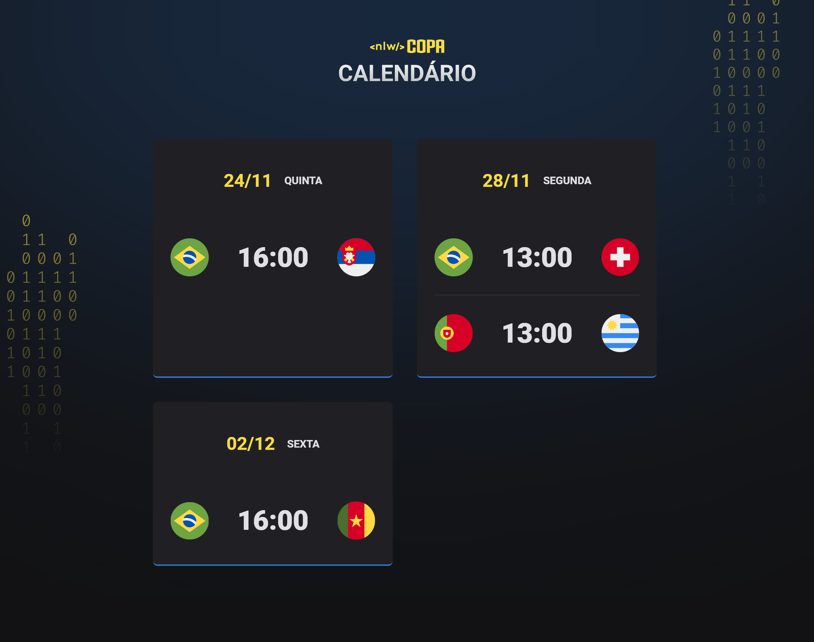

# Calendário de Jogos

## Projeto 💻
Projeto desenvolvido durante a NLW-Copa da Rocketseat na Trilha Explorer.  
(https://www.figma.com/file/C8RoJQIaGoUDgqd1ZR4pG0/Calend%C3%A1rio-de-Jogos-(Community))

## Tecnologias 🚀
As tecnologias utilizadas neste projeto são:
- HTML
- CSS
- JavaScript

## Créditos ❤️
Feito por [Millene Eduarda Ishiyama](https://github.com/miishiyama/).
